# SmartView

SmartView 是一个面向开发者的模拟面试系统，目标不是简单题库问答，而是围绕候选人的 PDF 简历、项目经历、岗位方向和作答内容，生成接近真实企业面试的动态追问链路，并在面试结束后输出可学习的复盘报告和参考答案。

当前仓库处于 v1.0 规划与工程落地准备阶段，核心设计依据来自：

- `develop_plan/plan_1.0.md`：产品目标、总体架构、业务流程、数据模型和工程约束。
- `develop_plan/smartview-task-plan_1.0.md`：从 v0.1 到 v1.0 的实施任务、验收标准和测试要求。
- `docs/interview-policy.md`：面试策略与执行规范，定义阶段控制、候选池、幂等性和降级规则。
- `docs/resume-workflow.md`：简历处理工作流，定义上传、解析、向量入库、画像分析的完整时序。
- `docs/architecture-improvements.md`：架构优化总结，记录已解决的 8 个核心问题及实施清单。

## 项目目标

SmartView v1.0 聚焦两个面试方向：

- Java 后端
- Agent 开发

MVP 必须跑通以下主链路：

```text
注册登录 -> 上传 PDF 简历 -> 解析并确认画像 -> 选择面试方向 -> 动态问答 -> 生成报告与参考答案
```

第一版暂不做公司维度定制、难度选择、在线编码题、完整语音面试、流式输出、面试官语气模拟、面试计划预览和 Web 管理端知识库录入。

## 核心价值

- 基于简历快速理解候选人背景，而不是随机抽题。
- 结合岗位方向、简历项目、知识库和面经案例生成问题。
- 每次提问后预生成候选问题池，提交回答后结合阶段计划快速选择下一步。
- 面试结束后输出准备度、岗位匹配度、风险点、学习建议、覆盖情况和每题参考答案。

## 技术栈

| 层级 | 技术选型 | 职责 |
| --- | --- | --- |
| Web 前端 | React、Ant Design | 用户登录、简历上传确认、模拟面试、报告查看 |
| 业务后端 | Spring Boot、MyBatis Plus、Swagger/OpenAPI、JWT | 账号体系、业务主流程、鉴权、落库、任务编排、对外 REST API |
| AI 服务 | FastAPI、LangChain、LangGraph、RAG | 简历解析、画像分析、知识检索、出题、候选问题池、回答评估、报告生成 |
| 异步任务 | RabbitMQ | 简历解析、画像分析、报告生成、清理等耗时任务 |
| 主数据库 | MySQL | 用户、简历、面试会话、问题、回答、评估、报告、AI 任务状态 |
| 缓存 | Redis | 短期状态、候选问题池、会话临时数据、短期锁 |
| 文件存储 | MinIO/对象存储 | 原始 PDF 简历文件 |
| 向量库 | Chroma/Milvus | 八股知识、面经案例、简历切片向量 |
| 基础设施 | Docker Compose | 本地依赖服务编排 |

## 技术选型说明

项目当前选型优先服务于 MVP 快速落地，同时保留企业级演进空间。核心原则是通过 `AiServiceClient`、`ObjectStorageService`、`VectorStoreService` 等内部接口隔离具体实现，避免业务流程直接绑定单一框架或存储产品。

**关键职责分离：**
- **Spring Boot**：负责业务主流程、鉴权、数据落库、任务编排和阶段决策（`StagePolicyEngine`）
- **FastAPI**：负责 AI 能力，只返回评估事实和候选问题，不做业务决策
- **详见**：`docs/interview-policy.md` 第 1 节

| 方向 | 当前选择 | 选择理由 | 后续演进 |
| --- | --- | --- | --- |
| AI 编排 | LangChain + LangGraph | LangChain 负责模型、工具、RAG 等能力适配；LangGraph 负责简历解析、面试问答、报告生成等有状态多步骤流程。 | 保持接口隔离，后续可按场景替换或补充 LlamaIndex、Haystack、自研编排等方案。 |
| 文件存储 | MinIO/对象存储 | PDF 简历和报告文件不进入 MySQL，只在数据库保存元数据；MinIO 兼容 S3 API，适合本地开发、私有化部署和后续迁移。 | 公有云生产环境可迁移到 OSS、COS、S3、OBS 等托管对象存储。 |
| 向量检索 | Chroma 起步，预留 Milvus | Chroma 接入简单，适合 MVP 阶段验证知识库、面经和简历切片检索效果。 | 数据量、并发和多租户要求提升后，优先评估 Qdrant、Milvus/Zilliz 或云托管向量库。 |

## 总体架构图

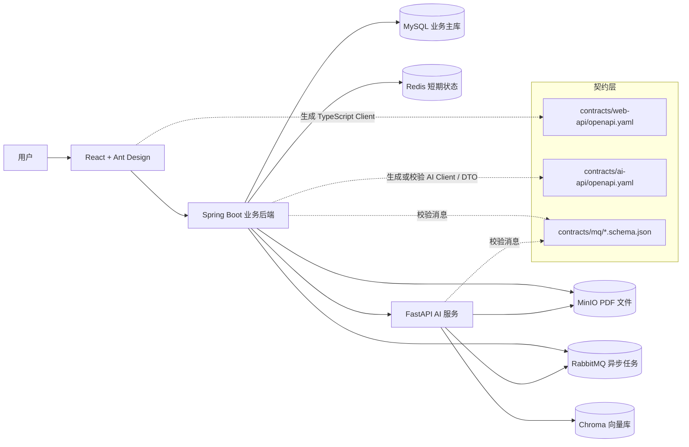

## 分层职责图

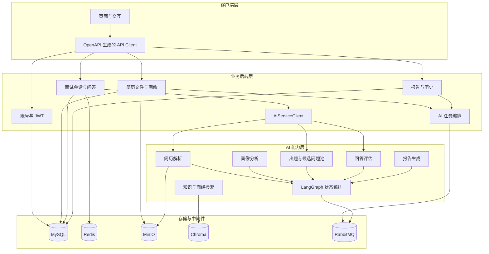

## 目标目录结构

```text
SmartView/
  AGENTS.md
  README.md
  develop_plan/
    plan_1.0.md
    smartview-task-plan_1.0.md
  contracts/
    web-api/
      openapi.yaml
    ai-api/
      openapi.yaml
    mq/
      resume_parse_task.schema.json
      resume_parse_result.schema.json
      profile_analyze_task.schema.json
      profile_analyze_result.schema.json
      report_generate_task.schema.json
      report_generate_result.schema.json
  smartview-web/
  smartview-server/
  smartview-ai/
  smartview-infra/
  knowledge/
    interview_knowledge_base/
    interview_experience_cases/
  docs/
```

## 模块边界

| 模块 | 说明 | 关键约束 |
| --- | --- | --- |
| `contracts/` | 跨服务接口契约，是联调事实来源 | 字段变更必须先改契约，再生成 Client / DTO |
| `smartview-web/` | React 前端 | 只调用 Spring Boot，不直接调用 FastAPI |
| `smartview-server/` | Spring Boot 业务后端 | 写业务主库，统一封装 AI 能力，维护任务状态 |
| `smartview-ai/` | FastAPI AI 服务 | 不直接写业务主表，通过 HTTP 或 MQ 返回结果 |
| `smartview-infra/` | 本地基础设施 | MySQL、Redis、RabbitMQ、MinIO、Chroma |
| `knowledge/` | 离线知识材料 | 八股知识与面经案例分层维护 |
| `docs/` | 设计、契约、部署、入库文档 | 与 `AGENTS.md` 和契约文件保持一致 |

## 业务主流程图

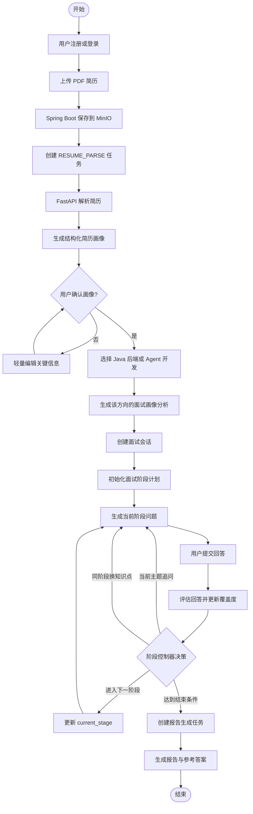

## 面试阶段控制策略

面试问答不是单纯围绕第一题持续追问，而是由阶段计划驱动。用户先选择 Java 后端或 Agent 开发方向，系统再生成该方向的画像分析，并在创建会话时根据面试方向、简历画像和画像分析生成阶段计划。后续每次选择下一题时同时参考当前回答、已问历史、阶段覆盖度和候选池。

画像分析是系统内部的面试准备材料，不是给用户展示的标签清单。它把已确认简历转成面试可用的结构化依据，例如技能标签、项目图谱、风险点、建议主题和阶段覆盖目标，用来帮助系统决定先问什么、哪些项目值得追问、什么时候切换阶段。

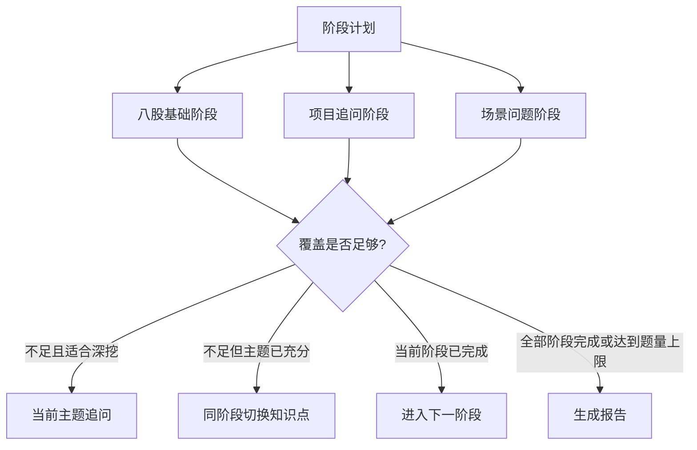

阶段控制器需要限制单一主题的连续追问深度，避免一直锚定第一题；候选问题池只提供追问、换题和切阶段入口等备选问题，最终下一步动作由阶段计划和覆盖度共同决定。

阶段计划至少需要定义各阶段题量范围、必须覆盖主题、单主题最大连续追问数、总题量上限和阶段切换条件。

**核心决策机制：**
- FastAPI 只返回评估事实（得分、命中点、缺失点）和候选问题池（0-2 道追问候选）
- Spring Boot 的 `StagePolicyEngine` 根据阶段计划、覆盖度和评估事实，独立决策 `nextAction`
- 决策规则按 5 条优先级执行：硬性终止 > 阶段推进 > 追问深度限制 > 候选池降级 > 正常流程
- **详见**：`docs/interview-policy.md` 第 2.4 节

## 简历解析时序图

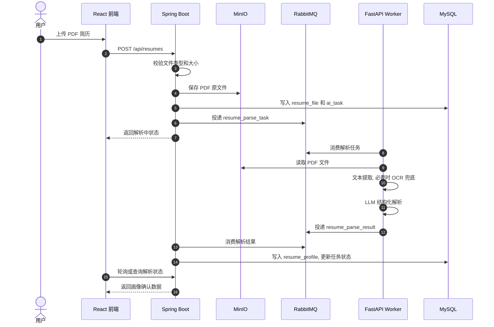

## 面试问答时序图

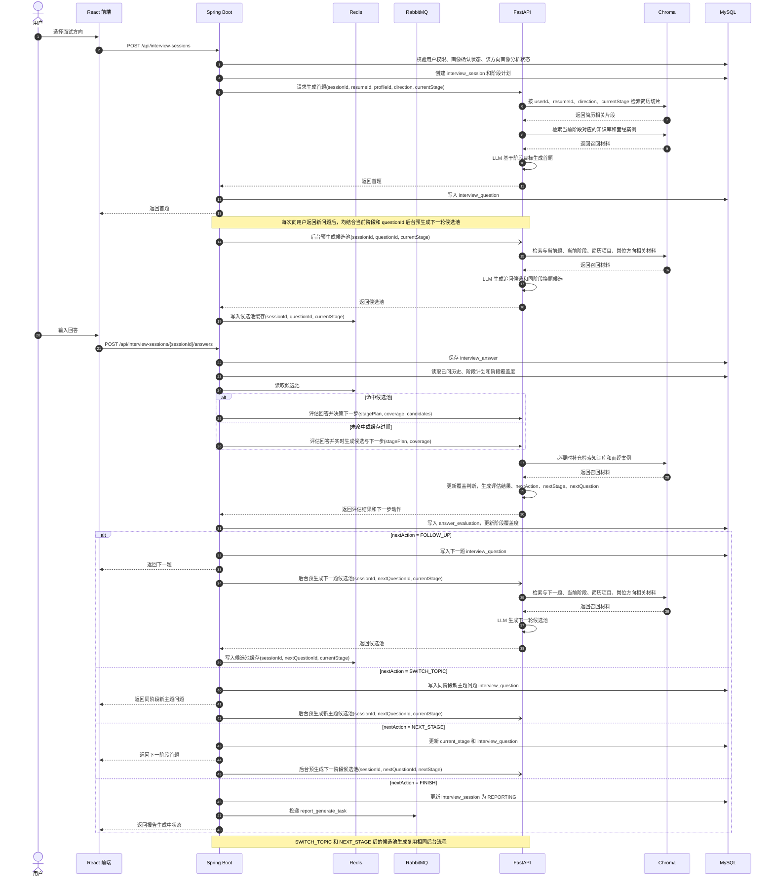

## 异步任务流转图

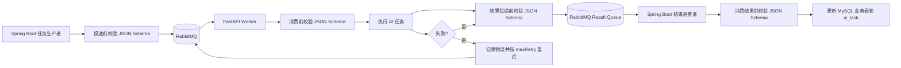

适合异步化的任务：简历解析、OCR 兜底、画像分析、报告生成、文件与向量数据清理。

不适合异步化的任务：用户提交回答后立即决定下一题。这个链路需要稳定响应，应同步返回下一题或结束状态。

## 面试会话状态图

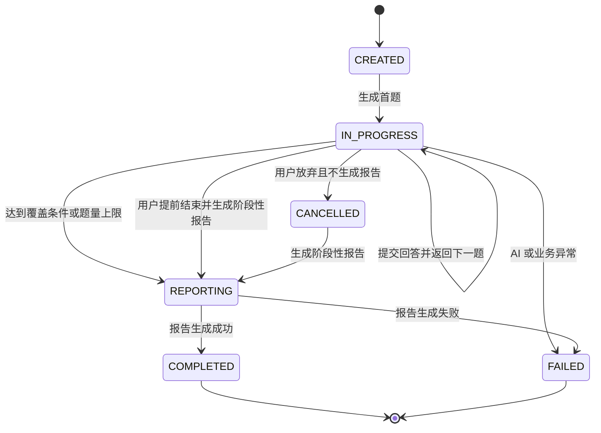

状态恢复原则：MySQL 保存权威状态；Redis 只保存短期候选问题池和临时上下文；页面刷新后前端根据会话 ID 拉取当前问题和历史问答；Redis 丢失时可基于 MySQL 与 LangGraph checkpoint 重建候选问题池。

## 核心数据模型 ER 图

```mermaid
erDiagram
    USER ||--o{ RESUME_FILE : uploads
    USER ||--o{ RESUME_PROFILE : owns
    USER ||--o{ PROFILE_ANALYSIS : owns
    USER ||--o{ INTERVIEW_SESSION : starts
    USER ||--o{ AI_TASK : owns

    RESUME_FILE ||--o| RESUME_PROFILE : parsed_to
    RESUME_PROFILE ||--o{ PROFILE_ANALYSIS : analyzed_as
    RESUME_PROFILE ||--o{ INTERVIEW_SESSION : used_by
    PROFILE_ANALYSIS ||--o{ INTERVIEW_SESSION : guides

    INTERVIEW_SESSION ||--o{ INTERVIEW_QUESTION : contains
    INTERVIEW_SESSION ||--o{ INTERVIEW_ANSWER : receives
    INTERVIEW_SESSION ||--o{ ANSWER_EVALUATION : evaluates
    INTERVIEW_SESSION ||--o| INTERVIEW_REPORT : generates

    INTERVIEW_QUESTION ||--o{ INTERVIEW_ANSWER : answered_by
    INTERVIEW_QUESTION ||--o{ ANSWER_EVALUATION : evaluated_by
    INTERVIEW_ANSWER ||--o| ANSWER_EVALUATION : has
    INTERVIEW_REPORT ||--o{ REFERENCE_ANSWER : includes
    INTERVIEW_QUESTION ||--o{ REFERENCE_ANSWER : explains

    USER {
        bigint id PK
        string username UK
        string password_hash
        string status
        datetime last_login_at
    }

    RESUME_FILE {
        bigint id PK
        bigint user_id FK
        string object_key
        string file_hash
        string parse_status
        string parse_task_id
    }

    RESUME_PROFILE {
        bigint id PK
        bigint user_id FK
        bigint resume_file_id FK
        string candidate_name
        json profile_json
        string confirm_status
        int version
    }

    PROFILE_ANALYSIS {
        bigint id PK
        bigint resume_profile_id FK
        string role_direction
        json skill_tags_json
        json project_graph_json
        json risk_points_json
    }

    INTERVIEW_SESSION {
        bigint id PK
        bigint user_id FK
        bigint resume_profile_id FK
        bigint profile_analysis_id FK
        string role_direction
        string status
        string current_stage
        string current_topic
        json stage_plan_json
        json stage_coverage_json
        bigint current_question_id
        int question_count
        int expected_min_questions
        int expected_max_questions
        int version
        string end_reason
        string graph_thread_id
        string latest_checkpoint_id
    }

    INTERVIEW_QUESTION {
        bigint id PK
        bigint session_id FK
        int question_order
        bigint parent_question_id
        string stage
        string question_type
        string source_type
        json expected_points_json
    }

    INTERVIEW_ANSWER {
        bigint id PK
        bigint session_id FK
        bigint question_id FK
        string request_id
        text answer_text
        string answer_mode
        int duration_seconds
    }

    ANSWER_EVALUATION {
        bigint id PK
        bigint answer_id FK
        int score
        string level
        json matched_points_json
        json missing_points_json
        string next_action
        bigint selected_next_question_id
        json candidate_pool_snapshot_json
    }

    INTERVIEW_REPORT {
        bigint id PK
        bigint session_id FK
        int overall_score
        int role_fit_score
        string readiness_level
        string status
        json coverage_json
    }

    REFERENCE_ANSWER {
        bigint id PK
        bigint report_id FK
        bigint question_id FK
        string answer_type
        text reference_content
        json key_points_json
    }

    AI_TASK {
        bigint id PK
        string task_id UK
        bigint user_id FK
        string task_type
        string task_status
        string trace_id
        string message_type
        string schema_version
    }
```

## 契约治理流程

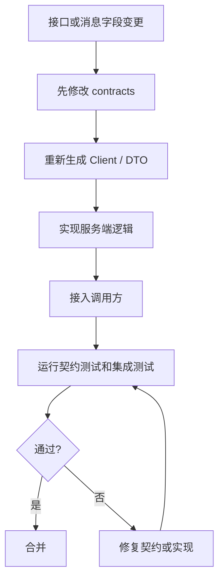

契约边界：

- `contracts/web-api/openapi.yaml`：React 与 Spring Boot 的业务接口。
- `contracts/ai-api/openapi.yaml`：Spring Boot 与 FastAPI 的 AI 能力接口。
- `contracts/mq/*.schema.json`：Spring Boot 与 FastAPI Worker 的异步消息结构。

关键规则：

- 前端不手写业务接口类型，只使用 OpenAPI 生成的 TypeScript Client。
- Spring Boot 调用 FastAPI 必须走统一的 `AiServiceClient`。
- MQ 消息至少包含 `taskId`、`traceId`、`messageType`、`schemaVersion`、`retryCount`、`createdAt`。
- 生成目录不可手工修改；如果生成代码不满足需求，先修改契约。

## 部署拓扑图

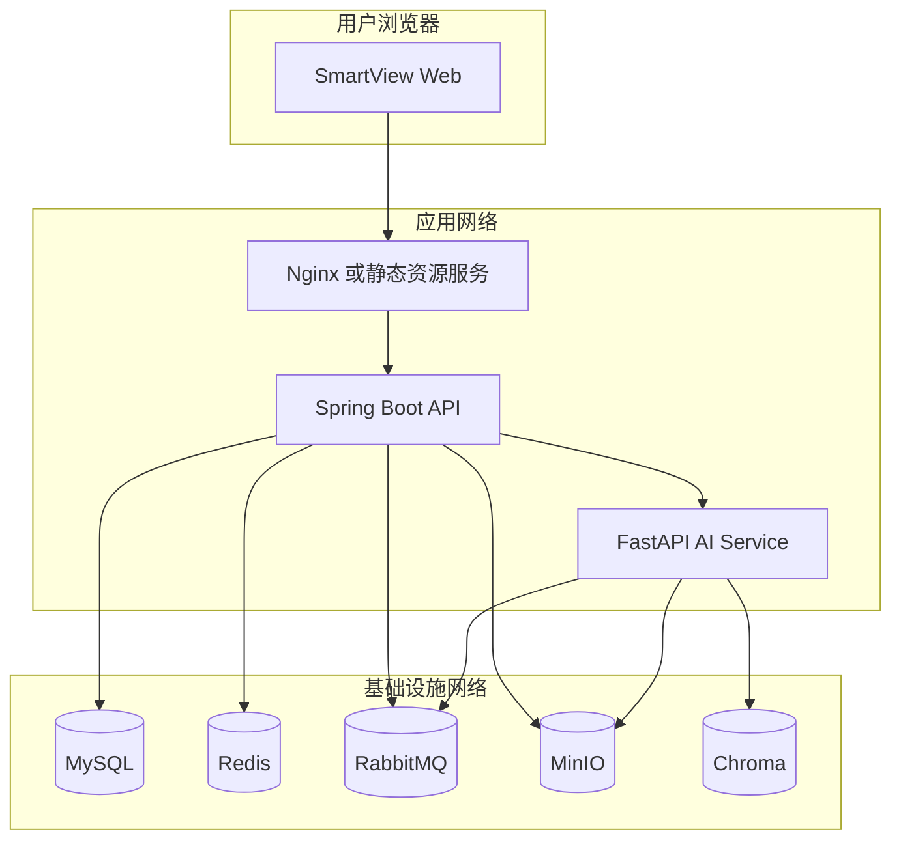

## 版本路线图

| 版本 | 目标 | 交付重点 |
| --- | --- | --- |
| v0.1 | 工程骨架与契约基础 | monorepo、基础设施、契约目录、最小可启动服务 |
| v0.2 | 账号体系与前端基础流程 | 注册登录、JWT、统一响应、前端基础布局 |
| v0.3 | PDF 简历上传与解析闭环 | MinIO、RabbitMQ、FastAPI 简历解析、画像确认 |
| v0.4 | 知识库、面经库与画像分析 | Markdown 入库、Chroma 检索、画像分析 |
| v0.5 | 模拟面试主流程 | 会话管理、候选问题池、阶段控制、回答评估、下一题选择 |
| v0.6 | 报告、参考答案、历史与清理 | 报告生成、参考答案、历史记录、软删除 |
| v1.0 | 质量收口 | 契约测试、集成测试、部署文档、回归保障 |

## MVP 验收清单

- [ ] 用户可以注册、登录、退出。
- [ ] 用户可以上传中文 PDF 简历。
- [ ] 系统可以保存 PDF 到 MinIO。
- [ ] 系统可以解析文本型 PDF 并生成结构化画像。
- [ ] 用户可以确认简历画像。
- [ ] 系统可以在确认简历后完成简历切片向量入库。
- [ ] 系统可以在选择方向后生成该方向画像分析。
- [ ] 开发者可以离线导入八股知识和面经材料。
- [ ] 用户可以选择 Java 后端或 Agent 开发方向开始面试。
- [ ] 系统可以基于简历、知识库和面经提出问题。
- [ ] 系统可以在每次提问后生成候选问题池。
- [ ] 系统可以按阶段计划控制追问、换题、切阶段和结束。
- [ ] 用户提交回答后，系统可以评估并返回下一题。
- [ ] 用户重复提交回答不会重复推进会话。
- [ ] 用户可以提前结束面试。
- [ ] 系统可以生成面试报告和每题参考答案。
- [ ] 页面刷新后可以恢复当前面试会话。
- [ ] 前端不直接调用 FastAPI。
- [ ] Spring Boot 不绕过 `AiServiceClient` 调 FastAPI。
- [ ] MQ 消息符合 JSON Schema。
- [ ] MQ 任务投递、消费和重试具备幂等保障。
- [ ] OpenAPI 契约可以生成前端 Client。
- [ ] 主链路集成测试通过。

## 本地开发入口

当前 README 先定义项目架构和企业级工程蓝图。工程代码落地后，本节应补齐具体命令：

```bash
# 启动基础设施
cd smartview-infra
docker compose up -d

# 启动 Spring Boot
cd ../smartview-server
./mvnw spring-boot:run

# 启动 FastAPI
cd ../smartview-ai
uvicorn app.main:app --reload --port 8000

# 启动 React 前端
cd ../smartview-web
npm install
npm run dev
```

**核心规范文档（必读）：**

- `docs/interview-policy.md`：面试策略与执行规范，定义职责边界、阶段控制、候选池、幂等性和降级规则。
- `docs/resume-workflow.md`：简历处理工作流，定义上传、解析、向量入库、画像分析的完整时序。
- `docs/architecture-improvements.md`：架构优化总结，记录已解决的 8 个核心问题及待实施清单。

**后续建议补充文档：**

- `docs/local-development.md`：本地启动、环境变量、常见问题。
- `docs/api-contracts.md`：OpenAPI 生成、契约变更流程。
- `docs/mq-contracts.md`：MQ Schema、消息版本、重试与幂等。
- `docs/knowledge-ingestion.md`：八股知识与面经材料入库流程。

## 工程约束

- 所有面向用户的提示、错误、空状态、按钮、表单标签和引导文案优先使用中文。
- 复杂逻辑、边界处理、兼容性处理和重要取舍需要添加必要注释，避免机械注释。
- React 只调用 Spring Boot 暴露的 `web-api`。
- Spring Boot 是业务主库写入方，FastAPI 不直接写业务主表。
- Spring Boot 调 FastAPI 只能通过统一 AI Client，不在业务代码中散落 HTTP 调用。
- Redis 不能作为唯一状态来源，权威状态必须落 MySQL。
- 接口变更必须先改契约，再生成代码，再实现逻辑，再运行测试。

## 成功标准

SmartView v1.0 成功的标志不是题库规模，而是用户能完成一条完整、真实、有反馈价值的模拟面试链路：上传简历后，系统能理解项目背景；问题能围绕简历和岗位方向展开；Java 后端和 Agent 开发方向都能跑通；项目追问和场景题衔接自然；最终报告能明确指出优势、薄弱点、风险和下一步学习建议。
