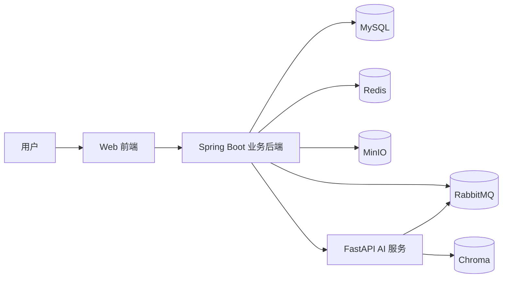

# SmartView 模拟面试系统开发计划 v1.0

> 面试阶段覆盖、下一步动作、候选题排序、单轮恢复和降级规则统一以 `docs/interview-policy.md` 为事实来源。本文只保留总体架构和数据边界，避免在多处维护策略细节。

## 1. 项目背景

SmartView 的目标不是做一个简单的题库问答工具，而是做一个面向开发者的模拟面试系统。

企业真实面试里，面试官通常不是按固定题单提问，而是会先看简历，再围绕项目经历、岗位方向和候选人回答不断追问。因此，系统的核心价值不是“随机出题”，而是：

1. 基于简历快速理解候选人背景。
2. 根据岗位方向和简历项目，生成更像真实企业面试的问题。
3. 在候选人作答过程中，动态推断下一步可能追问的问题。
4. 面试结束后给出可学习的参考答案和复盘报告。

第一版聚焦两个方向：

- Java 后端
- Agent 开发

同时，第一版不做难度选择，不做公司选择，不做代码题，不做完整语音面试，也不暴露复杂的内部面试计划给用户。

---

## 2. MVP 目标

### 2.1 核心目标

- 用户可注册、登录。
- 用户上传 PDF 简历，系统自动解析。
- 系统生成候选人画像，并让用户确认必要信息。
- 用户选择面试方向后开始模拟面试。
- 系统根据简历中的项目和知识库进行提问。
- 系统在每次提问后生成候选问题池，并结合阶段计划快速选择下一步。
- 结束后输出面试报告、问题复盘和参考答案。

### 2.2 非目标

第一版暂不实现：

- 公司维度定制面试风格
- 难度分层
- 在线编码题
- 完整语音面试
- 面试过程中的流式输出
- 面试官语气模拟
- 面试计划预览
- Web 端知识库录入界面

---

## 3. 用户流程

### 3.1 主流程

1. 用户注册 / 登录。
2. 用户上传 PDF 简历。
3. 系统解析简历并生成结构化画像。
4. 用户确认或微调解析结果。
5. 用户选择面试方向：Java 后端 / Agent 开发。
6. 系统生成该方向的画像分析。
7. 系统启动模拟面试会话并初始化阶段计划。
8. 系统提问，用户回答。
9. 回答期间，系统按当前阶段预生成候选池。
10. 用户提交后，系统结合阶段计划、覆盖度和候选池决定追问、换题、切阶段或结束。
11. 系统根据完成情况结束面试并生成报告。

### 3.2 面试问题构成

问题由三类组成：

- 基础八股
- 项目追问
- 场景设计

第一版不做“只考单一方向”。如果用户简历中同时存在 Java 项目和 Agent 项目，系统应综合这些信息，优先提问企业更可能关心的交叉问题，而不是机械地只问某一个标签。

---

## 4. 总体方案

### 4.1 技术栈

- 前端：React + Ant Design
- Java 业务后端：Spring Boot + MyBatis Plus + Swagger/OpenAPI + JWT
- AI 服务：FastAPI + LangChain + LangGraph
- 数据存储：MySQL + Redis + MinIO + Chroma + RabbitMQ

### 4.2 架构分层



### 4.3 职责划分

- Spring Boot：负责账号体系、简历文件管理、会话管理、`StagePolicyEngine` 确定性阶段决策、报告落库、任务编排、对外 REST API 和业务主库写入。
- FastAPI + LangGraph：负责简历解析、方向相关画像分析、知识检索、出题、候选池生成、答案评估事实和参考答案生成，不直接推进业务会话状态。
- RabbitMQ：负责异步任务，避免解析、报告生成、清理等重任务阻塞主流程。
- MySQL：作为业务主库。
- Redis：保存临时状态、候选题池、短期缓存和短期锁；权威会话状态必须以 MySQL 为准。
- MinIO：保存原始 PDF 简历文件。
- Chroma：保存知识向量、面经向量、简历切片向量。

### 4.4 代码组织架构

项目采用 monorepo 方式组织。第一版建议目录如下：

```text
SmartView/
  AGENTS.md
  README.md
  develop_plan/
    plan_1.0.md
  contracts/
    web-api/
      openapi.yaml
    ai-api/
      openapi.yaml
    mq/
      resume_parse_task.schema.json
      resume_parse_result.schema.json
      report_generate_task.schema.json
  smartview-web/
  smartview-server/
  smartview-ai/
  smartview-infra/
  knowledge/
    interview_knowledge_base/
    interview_experience_cases/
  docs/
```

各目录职责：

- `AGENTS.md`：约束 AI 编码工具的开发规则，包括接口契约、测试要求、禁止事项。
- `contracts/`：保存前后端、后端与 AI 服务、MQ 消息之间的契约，是跨服务接口的事实来源。
- `smartview-web/`：React + Ant Design 前端项目。
- `smartview-server/`：Spring Boot 业务后端。
- `smartview-ai/`：FastAPI + LangChain + LangGraph AI 服务。
- `smartview-infra/`：Docker Compose、MySQL、Redis、RabbitMQ、MinIO、Chroma 等基础设施配置。
- `knowledge/`：开发者离线维护的八股知识和面经材料。
- `docs/`：系统设计、接口说明、部署说明、后续演进文档。

### 4.5 前端代码结构

`smartview-web/` 建议按业务域和通用能力拆分：

```text
smartview-web/
  src/
    api/
      generated/
      request.ts
    app/
      router.tsx
      store.ts
    pages/
      login/
      resume/
      interview/
      report/
    features/
      auth/
      resume/
      interview/
      report/
    components/
    hooks/
    utils/
    types/
```

前端规则：

- `api/generated/` 只能由 OpenAPI 生成，不手工修改。
- 页面代码不直接拼 URL，统一调用生成的 API Client。
- `pages/` 负责页面组织，`features/` 负责业务模块逻辑，`components/` 放可复用 UI 组件。
- 前端只调用 Spring Boot 暴露的 `web-api`，禁止直接调用 FastAPI。

### 4.6 Spring Boot 代码结构

`smartview-server/` 建议使用按业务域分包的方式：

```text
smartview-server/
  src/main/java/com/smartview/
    SmartViewApplication.java
    common/
      api/
      exception/
      pagination/
      validation/
    config/
    security/
    user/
      controller/
      service/
      mapper/
      entity/
      dto/
    resume/
      controller/
      service/
      mapper/
      entity/
      dto/
    interview/
      controller/
      service/
      mapper/
      entity/
      dto/
    report/
      controller/
      service/
      mapper/
      entity/
      dto/
    ai/
      client/
      dto/
    task/
      mq/
      service/
      entity/
    infra/
      minio/
      redis/
      rabbitmq/
```

Spring Boot 规则：

- Controller 只处理 HTTP 入参、鉴权上下文和响应封装，不写复杂业务逻辑。
- Service 负责业务编排和事务边界。
- Mapper 只负责数据库访问。
- `ai/client/` 是 Spring Boot 调用 FastAPI 的唯一入口。
- 禁止业务代码绕过 `AiServiceClient` 直接发起 FastAPI HTTP 请求。
- 禁止使用 `Map<String, Object>` 代替明确 DTO 承载跨服务请求。
- Spring Boot 是业务主库的写入方，FastAPI 不直接写业务主表。

### 4.7 FastAPI 代码结构

`smartview-ai/` 建议按 API、图编排、节点、检索、任务 Worker 拆分：

```text
smartview-ai/
  app/
    main.py
    api/
      v1/
        resume.py
        interview.py
        report.py
    core/
      config.py
      logging.py
      errors.py
    schemas/
      resume.py
      interview.py
      report.py
      mq.py
    services/
      resume_parser.py
      profile_analyzer.py
      question_generator.py
      answer_evaluator.py
      report_generator.py
    graphs/
      interview_graph.py
      resume_graph.py
      report_graph.py
    nodes/
      retrieve_knowledge.py
      generate_question.py
      evaluate_answer.py
      build_candidate_pool.py
      stage_controller.py
      select_next_question.py
    retrievers/
      knowledge_retriever.py
      experience_retriever.py
      resume_retriever.py
    workers/
      resume_worker.py
      report_worker.py
    clients/
      chroma_client.py
      minio_client.py
      rabbitmq_client.py
    checkpoints/
    tests/
```

FastAPI 规则：

- `schemas/` 使用 Pydantic 定义请求、响应和 MQ 消息结构。
- `api/v1/` 只暴露同步 AI 能力接口，不承载复杂流程。
- `graphs/` 负责编排 LangGraph 流程。
- `nodes/` 放单个可组合的 LangGraph 节点。
- `retrievers/` 统一封装 Chroma 检索逻辑。
- `workers/` 消费 RabbitMQ 异步任务。
- AI 服务通过 HTTP 或 MQ 返回结果，由 Spring Boot 负责业务落库。

### 4.8 生成代码与手写代码边界

生成代码必须放在固定目录，避免 AI 工具误改：

- 前端生成代码：`smartview-web/src/api/generated/`
- Spring Boot 调 FastAPI 的生成 DTO 或 Client：`smartview-server/src/main/java/com/smartview/ai/dto/` 或 `ai/client/generated/`
- OpenAPI 文件：`contracts/web-api/openapi.yaml`、`contracts/ai-api/openapi.yaml`
- MQ Schema：`contracts/mq/*.schema.json`

约束规则：

- 生成目录中的文件不得手工修改。
- 如果生成代码不满足需求，先修改契约，再重新生成。
- 手写业务代码只能依赖生成类型，不能复制一份相似结构。
- 所有跨服务字段变更必须从 `contracts/` 开始。

---

## 5. 业务流程设计

### 5.1 简历上传与解析

用户不手填简历，而是上传 PDF 文件。

系统流程如下：

1. 前端上传 PDF。
2. Spring Boot 保存文件到 MinIO。
3. 创建解析任务并投递到 RabbitMQ。
4. AI 服务拉取任务。
5. 优先做 PDF 文本提取。
6. 如果文本不可用，则走 OCR 兜底。
7. 输出结构化简历数据，包括：
   - 基本信息
   - 教育背景
   - 工作经历
   - 项目经历
   - 技能栈
   - 可能的亮点与风险点
8. 用户在前端确认结果。
9. 用户确认后，系统向量化简历切片，供后续按 `user_id`、`resume_profile_id`、`role_direction` 检索。
10. 用户选择面试方向后，再生成该方向的画像分析和项目标签。

### 5.2 面试会话

会话开始后，系统不直接展示内部面试计划，而是自然地推进问答。

系统内部会维护：

- 阶段计划
- 阶段覆盖度
- 当前阶段
- 当前主题
- 当前问题
- 题目数量
- 预期完成区间
- 面试策略版本
- LangGraph checkpoint 信息

用户侧只看到自然的面试过程和完成进度，不看到内部计划细节。

画像分析是面试流程的内部依据，不是给用户看的标签展示。它把已确认简历转成某个面试方向下的技能标签、项目图谱、风险点和建议主题，用于生成阶段计划和出题策略。

### 5.3 候选问题池机制

这是本系统的关键设计。

做法是：

1. 系统先提出当前问题。
2. 每次向用户提出问题后，后台提前生成同阶段换题和下一阶段入口候选，作为低延迟路径和 AI 超时兜底。
3. 用户提交后，FastAPI 评估回答，并同步生成最多两道与回答事实、缺口或矛盾相关的追问候选。
4. Spring Boot 的 `StagePolicyEngine` 合并两类候选，按确定性规则校验题量、追问深度、覆盖缺口和终止条件。
5. `StagePolicyEngine` 决定继续追问、同阶段换知识点、进入下一阶段或结束，并持久化决策原因。
6. 继续进入下一轮。

这样可以兼顾：

- 面试感
- 响应速度
- 动态追问能力
- 阶段覆盖稳定性

### 5.4 终止与报告

当系统判断各阶段覆盖充分、用户提前结束，或者达到题量上限后，就结束该轮面试并异步生成报告。会话终态与报告生成状态相互独立：报告失败不得把已经结束的面试改成失败会话。

报告中要给出：

- 面试准备度
- 岗位匹配度
- 分项评分
- 风险点
- 学习建议
- 每道题的参考答案
- 覆盖情况

不展示“是否进入下一轮”这种内部判断。

---

## 6. AI 与知识库设计

### 6.1 知识来源分层

向量库中建议分成三类内容：

- `interview_knowledge_base`：八股知识、基础概念、标准答案要点
- `interview_experience_cases`：面经、真实问法、项目追问路径、场景改写方式
- `resume_profile_chunks`：用户简历切片、项目经历、技能描述，必须带 `user_id`、`resume_profile_id`、`profile_version` 等元信息

第一类用于保证知识正确性，第二类用于保证问题更贴近真实面试。
第三类用于让问题贴合用户简历，但不能作为权威业务数据源；简历画像和面试状态的权威数据仍在 MySQL。

### 6.2 出题原则

- 基础题优先依赖知识库。
- 项目题和场景题优先从面经案例中抽取，再结合简历内容改写。
- 如果简历里既有 Java 又有 Agent 项目，不应只看方向标签，而要综合项目内容决定提问。
- 系统必须避免“纯靠大模型瞎猜题目”。
- 出题必须服从阶段计划，避免一直围绕第一个主题深挖。

### 6.3 LangGraph 角色

LangGraph 适合做状态机式编排，用于：

- 简历画像生成
- 当前题目生成
- 候选问题池生成
- 用户回答评估
- 回答相关追问候选生成
- 报告生成

这类流程天然带有阶段状态，因此比单次 LLM 调用更适合。

阶段计划至少需要包含：

| 字段 | 含义 |
| --- | --- |
| `stages` | 阶段列表，例如 `BASIC`、`PROJECT`、`SCENARIO` |
| `policy_version` | 面试策略版本，创建会话后保持不变 |
| `total_min_questions` | 全场最少题数 |
| `total_max_questions` | 全场题量硬上限 |
| `min_questions` | 每个阶段最少题数 |
| `max_questions` | 每个阶段最多题数 |
| `required_topics` | 每个阶段必须覆盖的主题 |
| `max_follow_up_depth` | 单一主题最大连续追问深度 |
| `switch_conditions` | 切换主题或进入下一阶段的条件 |

阶段计划由 AI 根据画像给出草案，但必须先通过确定性不变量校验。最终动作只由 Spring Boot 的 `StagePolicyEngine` 按 `docs/interview-policy.md` 计算，FastAPI 不返回具有最终业务语义的 `nextAction`。

---

## 7. 状态与存储设计

### 7.1 MySQL 主要表

MySQL 是业务主库，保存用户、简历、面试会话、问题、回答、评估、报告和 AI 异步任务状态。

所有业务表建议保留通用字段：

| 字段 | 含义 |
| --- | --- |
| `id` | 主键 ID |
| `created_at` | 创建时间 |
| `updated_at` | 更新时间 |
| `deleted` | 软删除标记，`0` 表示未删除，`1` 表示已删除 |

#### 7.1.1 `user`

用户账号表，第一版只做简单登录注册体系。

| 字段 | 含义 |
| --- | --- |
| `id` | 用户 ID |
| `username` | 登录用户名，要求唯一 |
| `password_hash` | 加密后的密码，不保存明文密码 |
| `nickname` | 用户昵称 |
| `email` | 邮箱，可选 |
| `phone` | 手机号，可选 |
| `status` | 用户状态，例如 `ACTIVE`、`DISABLED` |
| `last_login_at` | 最近登录时间 |
| `created_at` | 创建时间 |
| `updated_at` | 更新时间 |
| `deleted` | 软删除标记 |

#### 7.1.2 `resume_file`

简历文件表，记录用户上传的 PDF 原文件和解析状态。

| 字段 | 含义 |
| --- | --- |
| `id` | 简历文件 ID |
| `user_id` | 所属用户 ID |
| `original_filename` | 用户上传时的原始文件名 |
| `object_key` | MinIO 中的文件对象 Key |
| `file_hash` | 文件 hash，用于去重或审计 |
| `file_size` | 文件大小，单位字节 |
| `mime_type` | 文件 MIME 类型，第一版主要为 `application/pdf` |
| `parse_status` | 解析状态，例如 `PENDING`、`PROCESSING`、`SUCCESS`、`FAILED` |
| `parse_task_id` | 对应的 AI 解析任务 ID |
| `error_message` | 解析失败原因 |
| `uploaded_at` | 上传时间 |
| `created_at` | 创建时间 |
| `updated_at` | 更新时间 |
| `deleted` | 软删除标记 |

#### 7.1.3 `resume_profile`

结构化简历画像表，保存从 PDF 中解析出的可确认信息。

| 字段 | 含义 |
| --- | --- |
| `id` | 简历画像 ID |
| `user_id` | 所属用户 ID |
| `resume_file_id` | 对应的简历文件 ID |
| `candidate_name` | 候选人姓名 |
| `contact_info_json` | 联系方式 JSON，例如手机号、邮箱 |
| `education_json` | 教育经历 JSON |
| `work_experience_json` | 工作经历 JSON |
| `project_experience_json` | 项目经历 JSON |
| `skills_json` | 技能栈 JSON |
| `raw_text` | PDF 提取或 OCR 得到的简历原文 |
| `profile_json` | 完整结构化解析结果 JSON |
| `confirm_status` | 用户确认状态，例如 `UNCONFIRMED`、`CONFIRMED` |
| `confirmed_at` | 用户确认时间 |
| `version` | 画像版本号，用户重新上传或重新解析时递增 |
| `created_at` | 创建时间 |
| `updated_at` | 更新时间 |
| `deleted` | 软删除标记 |

#### 7.1.4 `profile_analysis`

简历分析表，保存面试前由 AI 生成的能力标签、项目图谱和风险提示。

| 字段 | 含义 |
| --- | --- |
| `id` | 分析结果 ID |
| `user_id` | 所属用户 ID |
| `resume_profile_id` | 对应的简历画像 ID |
| `role_direction` | 面试方向，例如 `JAVA_BACKEND`、`AGENT_DEVELOPMENT` |
| `skill_tags_json` | 技能标签 JSON |
| `project_graph_json` | 项目关系图谱 JSON，包括项目、技术栈、职责、亮点 |
| `capability_hints_json` | 能力线索 JSON，例如工程能力、Agent 能力、系统设计能力 |
| `risk_points_json` | 风险点 JSON，例如项目描述空泛、技术深度不足 |
| `suggested_topics_json` | 建议面试主题 JSON |
| `model_name` | 生成该分析结果使用的模型名称 |
| `model_version` | 模型版本或配置版本 |
| `created_at` | 创建时间 |
| `updated_at` | 更新时间 |
| `deleted` | 软删除标记 |

#### 7.1.5 `interview_session`

面试会话表，保存一次模拟面试的主状态。

| 字段 | 含义 |
| --- | --- |
| `id` | 面试会话 ID |
| `user_id` | 所属用户 ID |
| `resume_profile_id` | 使用的简历画像 ID |
| `profile_analysis_id` | 使用的简历分析 ID |
| `role_direction` | 用户选择的面试方向 |
| `status` | 会话状态，例如 `CREATED`、`IN_PROGRESS`、`REPORTING`、`COMPLETED`、`CANCELLED`、`FAILED`。用户提前结束并生成阶段性报告时进入 `REPORTING`；用户放弃且不生成报告时进入 `CANCELLED` |
| `current_stage` | 当前内部阶段，例如 `BASIC`、`PROJECT`、`SCENARIO`、`REPORT` |
| `current_topic` | 当前主题，例如某个项目、某个技术点、某类场景 |
| `stage_plan_json` | 阶段计划 JSON，包括阶段顺序、题量范围、必问主题和切换条件 |
| `stage_coverage_json` | 阶段覆盖度 JSON，记录已覆盖主题、题数、追问深度和缺口 |
| `current_question_id` | 当前正在回答的问题 ID |
| `question_count` | 已提出的问题数量 |
| `expected_min_questions` | 预期最少问题数，用于进度展示 |
| `expected_max_questions` | 预期最多问题数，用于进度展示 |
| `version` | 乐观锁版本号，用于防止并发提交覆盖会话状态 |
| `end_reason` | 结束原因，例如 `PLAN_COMPLETED`、`QUESTION_LIMIT`、`USER_FINISHED_EARLY`、`USER_CANCELLED`、`FAILED` |
| `graph_thread_id` | LangGraph thread ID，用于后续恢复流程 |
| `latest_checkpoint_id` | 最近一次 LangGraph checkpoint ID |
| `started_at` | 面试开始时间 |
| `ended_at` | 面试结束时间 |
| `created_at` | 创建时间 |
| `updated_at` | 更新时间 |
| `deleted` | 软删除标记 |

#### 7.1.6 `interview_question`

面试问题表，保存系统提出的每一道题。

| 字段 | 含义 |
| --- | --- |
| `id` | 问题 ID |
| `session_id` | 所属面试会话 ID |
| `user_id` | 所属用户 ID |
| `question_order` | 当前会话中的问题序号 |
| `parent_question_id` | 父问题 ID，用于表示追问关系 |
| `stage` | 所属阶段，例如 `BASIC`、`PROJECT`、`SCENARIO` |
| `question_type` | 问题类型，例如 `OPENING`、`FOLLOW_UP`、`SWITCH_TOPIC`、`STAGE_ENTRY` |
| `topic` | 问题主题 |
| `question_text` | 问题正文 |
| `source_type` | 来源类型，例如 `KNOWLEDGE_BASE`、`EXPERIENCE_CASE`、`RESUME_PROJECT`、`MIXED` |
| `knowledge_refs_json` | 引用的八股知识片段信息 |
| `case_refs_json` | 引用的面经案例信息 |
| `expected_points_json` | 期望回答要点 JSON |
| `status` | 问题状态，例如 `ASKED`、`ANSWERED`、`SKIPPED` |
| `asked_at` | 提问时间 |
| `created_at` | 创建时间 |
| `updated_at` | 更新时间 |
| `deleted` | 软删除标记 |

#### 7.1.7 `interview_answer`

用户回答表，保存用户对每个问题的回答。

| 字段 | 含义 |
| --- | --- |
| `id` | 回答 ID |
| `session_id` | 所属面试会话 ID |
| `question_id` | 对应问题 ID |
| `user_id` | 所属用户 ID |
| `request_id` | 回答提交幂等 ID，防止重复提交生成多道下一题 |
| `answer_text` | 用户回答文本 |
| `answer_mode` | 回答方式，第一版主要为 `TEXT`，后续可扩展 `VOICE_TO_TEXT` |
| `duration_seconds` | 用户作答耗时，单位秒 |
| `submitted_at` | 提交时间 |
| `created_at` | 创建时间 |
| `updated_at` | 更新时间 |
| `deleted` | 软删除标记 |

#### 7.1.8 `answer_evaluation`

回答评估表，保存系统对某次回答的分析结果。

| 字段 | 含义 |
| --- | --- |
| `id` | 评估 ID |
| `session_id` | 所属面试会话 ID |
| `question_id` | 对应问题 ID |
| `answer_id` | 对应回答 ID |
| `score` | 回答得分，建议 0 到 100 |
| `level` | 回答等级，例如 `GOOD`、`NORMAL`、`WEAK` |
| `matched_points_json` | 已命中的要点 JSON |
| `missing_points_json` | 缺失要点 JSON |
| `risk_points_json` | 暴露的问题或风险 JSON |
| `next_action` | 下一步动作，例如 `FOLLOW_UP`、`SWITCH_TOPIC`、`NEXT_STAGE`、`FINISH` |
| `candidate_pool_snapshot_json` | 决策时使用的候选池快照 JSON |
| `selected_next_question_id` | 被选中的下一道题 ID，可为空 |
| `evaluation_text` | 简短评估说明 |
| `model_name` | 评估使用的模型名称 |
| `created_at` | 创建时间 |
| `updated_at` | 更新时间 |
| `deleted` | 软删除标记 |

#### 7.1.9 `interview_report`

面试报告表，保存一次面试结束后的整体复盘。

| 字段 | 含义 |
| --- | --- |
| `id` | 报告 ID |
| `session_id` | 对应面试会话 ID |
| `user_id` | 所属用户 ID |
| `resume_profile_id` | 使用的简历画像 ID |
| `overall_score` | 综合得分 |
| `readiness_level` | 面试准备度等级 |
| `role_fit_score` | 岗位匹配度得分 |
| `summary` | 总体评价 |
| `strengths_json` | 优势点 JSON |
| `weaknesses_json` | 薄弱点 JSON |
| `risk_points_json` | 风险点 JSON |
| `suggestions_json` | 学习建议 JSON |
| `coverage_json` | 覆盖情况 JSON，例如基础、项目、场景覆盖比例 |
| `status` | 报告状态，例如 `GENERATING`、`SUCCESS`、`FAILED` |
| `generated_at` | 报告生成时间 |
| `created_at` | 创建时间 |
| `updated_at` | 更新时间 |
| `deleted` | 软删除标记 |

#### 7.1.10 `reference_answer`

参考答案表，保存每道题的复盘参考内容。

| 字段 | 含义 |
| --- | --- |
| `id` | 参考答案 ID |
| `report_id` | 所属报告 ID |
| `session_id` | 所属面试会话 ID |
| `question_id` | 对应问题 ID |
| `answer_type` | 答案类型，例如 `BASIC_KEY_POINTS`、`PROJECT_STRUCTURE`、`SCENARIO_FRAMEWORK` |
| `reference_content` | 参考答案正文 |
| `key_points_json` | 关键要点 JSON |
| `tradeoffs_json` | 场景题中的权衡点 JSON |
| `created_at` | 创建时间 |
| `updated_at` | 更新时间 |
| `deleted` | 软删除标记 |

#### 7.1.11 `ai_task`

AI 任务表，保存异步任务状态，配合 RabbitMQ 做重试、追踪和结果落库。

| 字段 | 含义 |
| --- | --- |
| `id` | 主键 ID |
| `task_id` | 业务任务 ID，建议使用全局唯一字符串 |
| `user_id` | 所属用户 ID |
| `task_type` | 任务类型，例如 `RESUME_PARSE`、`PROFILE_ANALYZE`、`REPORT_GENERATE`、`CLEANUP` |
| `task_status` | 任务状态，例如 `PENDING`、`PROCESSING`、`SUCCESS`、`FAILED`、`RETRYING` |
| `biz_type` | 关联业务类型，例如 `RESUME_FILE`、`INTERVIEW_SESSION` |
| `biz_id` | 关联业务 ID |
| `request_payload_json` | 投递给 AI 服务的请求 JSON |
| `result_payload_json` | AI 服务返回的结果 JSON |
| `error_message` | 失败原因 |
| `retry_count` | 当前重试次数 |
| `max_retry` | 最大重试次数 |
| `trace_id` | 链路追踪 ID |
| `message_type` | MQ 消息类型 |
| `schema_version` | MQ 消息 schema 版本 |
| `started_at` | 任务开始时间 |
| `finished_at` | 任务结束时间 |
| `created_at` | 创建时间 |
| `updated_at` | 更新时间 |
| `deleted` | 软删除标记 |

### 7.2 会话核心字段

`interview_session` 是面试状态恢复的核心表。第一版虽然不做跨天续面，但至少要支持页面刷新后恢复当前会话，因此以下字段必须明确。

| 字段 | 含义 |
| --- | --- |
| `status` | 会话生命周期状态。`CREATED` 表示已创建未开始，`IN_PROGRESS` 表示面试中，`REPORTING` 表示报告生成中，`COMPLETED` 表示已完成，`CANCELLED` 表示用户放弃且不生成报告，`FAILED` 表示异常失败 |
| `current_stage` | 当前内部阶段。建议枚举为 `BASIC`、`PROJECT`、`SCENARIO`、`REPORT`，仅系统内部使用，不直接暴露给用户 |
| `current_topic` | 当前追问主题，例如某个简历项目、某个技术点、某个业务场景 |
| `stage_plan_json` | 阶段计划，是下一题选择的约束来源 |
| `stage_coverage_json` | 阶段覆盖度，是判断追问、换题、切阶段和结束的依据 |
| `current_question_id` | 当前正在等待用户回答的问题 ID。页面刷新后可根据它恢复当前题目 |
| `question_count` | 当前会话已经提出的问题数量 |
| `expected_min_questions` | 预期最少问题数，用于给用户展示大致进度 |
| `expected_max_questions` | 预期最多问题数，用于限制面试不要无限追问 |
| `version` | 乐观锁版本号，回答提交时必须校验，避免并发请求覆盖状态 |
| `end_reason` | 结束原因，用于区分正常完成、题量上限、用户提前结束和异常失败 |
| `graph_thread_id` | LangGraph 的线程 ID，用于把业务会话和图状态关联起来 |
| `latest_checkpoint_id` | 最近一次 LangGraph checkpoint ID，为后续跨天恢复预留 |
| `started_at` | 会话开始时间 |
| `ended_at` | 会话结束时间 |

状态恢复原则：

- MySQL 保存权威状态。
- Redis 可以缓存候选问题池和短期上下文，但不能作为唯一状态来源。
- 页面刷新时，前端根据当前会话 ID 拉取 `interview_session`、当前问题和历史问答。
- 如果 Redis 中候选问题池丢失，可以根据 MySQL 中的当前问题、历史问答和 LangGraph checkpoint 重新生成。
- 用户提交回答时必须校验 `request_id`、`current_question_id` 和 `version`，确保重复提交或并发提交不会生成多道下一题。

### 7.3 Redis 用途

Redis 适合保存：

- 当前会话临时态
- 候选题池
- 短期锁
- 任务执行中的中间结果

### 7.4 MinIO 与 Chroma

- MinIO 存原始 PDF。
- Chroma 存简历切片向量、八股知识、面经案例。
- 简历切片入库必须包含 `user_id`、`resume_profile_id`、`profile_version`、`role_direction` 等元信息，查询时由服务端生成过滤条件。
- 删除简历或更新画像版本时，需要异步清理旧版本向量，避免检索到过期内容。

---

## 8. 接口与交互原则

- 接口风格统一使用 RESTful。
- Spring Boot 接口使用 Swagger/OpenAPI 描述。
- 业务响应统一返回格式。
- 第一版不要求面试过程流式返回。
- 用户看到的是“提问 - 回答 - 下一题 - 结果”，而不是内部执行细节。

---

## 9. 接口契约与联调保障

SmartView 同时包含前端、Spring Boot 业务后端、FastAPI AI 服务和 RabbitMQ Worker。为了保证开发过程中接口调用正确，第一版必须建立接口契约机制，而不是依赖人工记忆字段。

### 9.1 调用边界

前端只调用 Spring Boot，不直接调用 FastAPI。

```text
React
  -> Spring Boot
      -> FastAPI
      -> RabbitMQ
```

这样前端只关心业务接口，AI 能力由 Spring Boot 统一封装。

系统接口分为三类：

- `web-api`：React 与 Spring Boot 之间的业务接口
- `ai-api`：Spring Boot 与 FastAPI 之间的 AI 能力接口
- `mq-contract`：Spring Boot 与 FastAPI Worker 之间的异步消息契约

### 9.2 契约文件目录

建议在仓库中维护统一契约目录：

```text
contracts/
  web-api/
    openapi.yaml
  ai-api/
    openapi.yaml
  mq/
    resume_parse_task.schema.json
    resume_parse_result.schema.json
    report_generate_task.schema.json
```

其中：

- Spring Boot 通过 Swagger/OpenAPI 输出 `web-api`。
- FastAPI 通过内置 OpenAPI 输出 `ai-api`。
- RabbitMQ 消息通过 JSON Schema 描述。

### 9.3 前端调用规则

前端不手写接口类型。

React 应根据 `web-api/openapi.yaml` 生成 TypeScript API Client，例如：

```text
src/api/generated/
  userApi.ts
  resumeApi.ts
  interviewApi.ts
  reportApi.ts
```

页面代码只调用生成后的 API 方法。这样后端字段改名、请求参数变化、返回结构变化时，前端可以通过类型检查提前发现问题。

### 9.4 Spring Boot 调用 FastAPI 规则

Spring Boot 不应在业务代码中随意使用 `Map<String, Object>` 拼接请求。

推荐做法：

- FastAPI 使用 Pydantic 定义 Request / Response。
- 导出 `ai-api/openapi.yaml`。
- Spring Boot 根据契约生成 Java Client 或 DTO。
- Spring Boot 通过统一的 `AiServiceClient` 调用 FastAPI。
- FastAPI 不直接读写业务主表；需要画像、问题、回答、评估等业务上下文时，由 Spring Boot 通过 AI 请求、MQ 消息或内部只读快照提供。

调用链保持为：

```text
Spring Controller
  -> Application Service
      -> AiServiceClient
          -> FastAPI
```

### 9.5 MQ 消息契约

RabbitMQ 消息必须有稳定 schema。每类消息至少包含：

- `taskId`
- `traceId`
- `messageType`
- `schemaVersion`
- `retryCount`
- `createdAt`

消息消费方必须先校验 schema，再执行业务逻辑。这样可以避免 Spring Boot 和 FastAPI Worker 对同一条消息的字段理解不一致。

### 9.6 契约测试与集成测试

第一版至少需要四类校验：

- 前端类型检查：验证生成的 TypeScript Client 可用。
- Spring Boot Controller 测试：验证业务接口入参和返回结构。
- Spring Boot 调 FastAPI 的契约测试：可使用 WireMock 模拟 FastAPI。
- Docker Compose 集成测试：覆盖核心链路。

核心链路至少包括：

```text
登录 -> 上传简历 -> 创建解析任务 -> FastAPI 解析 -> 确认画像 -> 开始面试 -> 回答 -> 生成报告
```

### 9.7 接口变更流程

接口变更遵循以下顺序：

1. 先修改契约。
2. 再生成前端 / 后端 Client 或 DTO。
3. 再实现服务端逻辑。
4. 再接入调用方。
5. 最后运行契约测试与集成测试。

对于字段删除、字段改名、枚举值变化等破坏性变更，必须同步修改调用方，并通过测试确认主流程没有断裂。

---

## 10. 异步任务设计

适合走 MQ 的任务：

- 简历解析
- OCR 兜底
- 画像分析
- 报告生成
- 文件与向量数据清理

异步任务必须具备可靠投递和幂等消费能力：

- Spring Boot 在业务事务内创建 `ai_task` 或 outbox 事件，再由发布器投递 MQ。
- 消息至少包含 `taskId`、`traceId`、`messageType`、`schemaVersion`、`retryCount`。
- 消费方以 `taskId` 幂等，重复消息不能重复落库或重复生成结果。
- 超过最大重试次数后进入失败状态或死信队列，便于人工排查。

不适合走 MQ 的场景：

- 用户答完后立即决定下一题

原因很简单：面试过程要求响应稳定，下一题选择必须尽快返回，不能把每一轮都做成长链路异步。

---

## 11. 版本范围与演进顺序

### 11.1 第一版范围

1. 注册登录
2. PDF 简历上传
3. 简历解析
4. 简历确认
5. Java / Agent 面试
6. 基础八股 + 项目追问 + 场景设计
7. 面试报告
8. 参考答案展示

### 11.2 后续可扩展项

- 语音输入
- 更丰富的岗位方向
- 跨天续面
- 细粒度画像标签
- 更复杂的报告指标
- 管理端知识库维护

---

## 12. 风险与处理

### 12.1 难度评估不稳定

问题难点在于，题目难度很难客观定义。

处理方式：

- 第一版不做难度选择。
- 以题型、知识点覆盖、项目深度代替难度分层。

### 12.2 简历解析质量波动

处理方式：

- 文本提取失败时走 OCR。
- 解析后让用户确认关键信息。

### 12.3 AI 出题不真实

处理方式：

- 强制依赖八股库 + 面经库。
- 项目题优先从真实案例改写。

### 12.4 会话状态丢失

处理方式：

- MySQL 保存主状态。
- Redis 保存短期态。
- LangGraph checkpoint 预留跨天恢复能力。

### 12.5 接口契约漂移

处理方式：

- HTTP 接口使用 OpenAPI 管理。
- MQ 消息使用 JSON Schema 管理。
- 前端和服务间调用尽量生成 Client 或 DTO。
- CI 中运行契约测试和核心集成测试。

### 12.6 简历隐私与向量串租

处理方式：

- MinIO Bucket 默认私有，文件访问通过后端鉴权后生成短期授权。
- 日志中不得输出联系方式、完整简历原文、用户回答全文和模型请求完整 Prompt。
- Chroma 查询的用户、简历和版本过滤条件由服务端生成，不能直接信任前端传入。
- 删除简历时必须同时清理 MinIO 文件和对应向量数据。

---

## 13. 实施里程碑

### 阶段 1：基础工程

- 初始化前后端与 AI 服务骨架
- 统一配置、日志、鉴权、Swagger
- 搭建 MySQL / Redis / MinIO / RabbitMQ / Chroma
- 建立 `contracts/` 契约目录

### 阶段 2：账号体系

- 注册 / 登录
- JWT 鉴权
- 用户基础资料

### 阶段 3：简历上传与解析

- PDF 上传
- 文本提取
- OCR 兜底
- 画像生成

### 阶段 4：知识库与出题

- 八股知识入库
- 面经入库
- 向量检索
- 初版出题链路

### 阶段 5：面试主流程

- 会话管理
- 候选问题池
- 回答评估
- 下一题选择

### 阶段 6：报告与复盘

- 报告生成
- 参考答案
- 覆盖情况统计

---

## 14. 成功标准

如果第一版上线后，用户能完成以下动作，就可以认为 MVP 目标达成：

- 上传 PDF 简历后，系统能自动理解项目背景。
- 面试问题能围绕简历真实展开，而不是泛泛而谈。
- Java 后端和 Agent 开发方向都能跑通。
- 面试过程能覆盖八股、项目追问和场景题阶段，而不是长期停留在首题附近。
- 项目追问和场景题能自然衔接。
- 最终报告能帮助用户知道自己哪里弱、哪里还要补。

---

## 15. 结论

SmartView v1.0 的核心，不是把“题库”堆大，而是把“简历理解 + 面试追问 + 结果复盘”做成一条完整链路。

这一版的正确方向是：

- 先把流程跑通
- 再把面试体验做真
- 最后再逐步增加复杂能力
