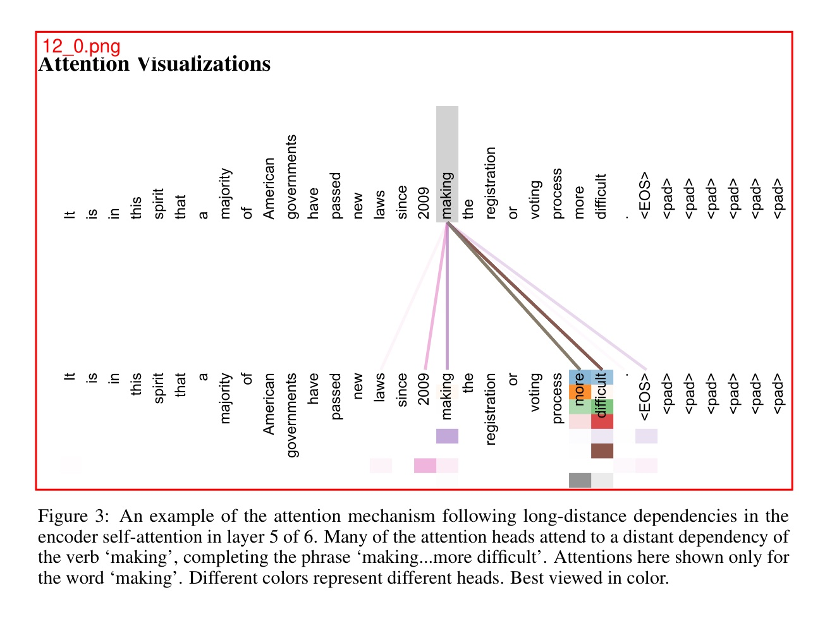

# gptpdf

<p align="center">
<a href="README_CN.md"></a>
<a href="README.md"></a>
</p>

使用视觉大语言模型（如 GPT-4o）将 PDF 解析为 markdown。

我们的方法非常简单(只有293行代码)，但几乎可以完美地解析排版、数学公式、表格、图片、图表等。

每页平均价格：0.013 美元

[pdfgpt-ui](https://github.com/daodao97/gptpdf-ui) 是一个基于 gptpdf 的可视化工具。

## 处理流程

1. 使用 PyMuPDF 库，对 PDF 进行解析出所有非文本区域，并做好标记，比如:



2. 使用视觉大模型（如 GPT-4o）进行解析，得到 markdown 文件。

## 样例

有关
PDF，请参阅 [examples/attention_is_all_you_need/output.md](examples/attention_is_all_you_need/output.md) [examples/attention_is_all_you_need.pdf](examples/attention_is_all_you_need.pdf)。

## 安装

```bash
pip install gptpdf
```

## 使用

### 本地安装使用

```python
from gptpdf import parse_pdf

api_key = 'Your OpenAI API Key'
content, image_paths = parse_pdf(pdf_path, api_key=api_key, save_images=False)
print(content)
```

默认不保存识别过程中的图片；`image_paths` 为空列表。如需保留页面/区域图片用于排查，可传 `save_images=True`。

更多内容请见 [test/test.py](test/test.py)

### 批量转换文件夹

`Script/main.py` 支持递归转换指定文件夹内的所有 PDF，并写入指定输出文件夹：

```bash
python Script/main.py \
  --input-dir 输入PDF文件夹 \
  --output-dir 输出Markdown文件夹 \
  --max-processes 5 \
  --gpt-worker 4
```

说明：

- 每个 PDF 由独立子进程转换，`--max-processes` 控制最大并发进程数，默认 5。
- `--gpt-worker` 控制单个 PDF 内部的页级并发线程数，默认 4。
- 输出文件名与 PDF 同名（如 `a.pdf` -> `a.md`），默认在输出目录下保留输入目录的相对结构；`--flatten` 可将所有 md 平铺到输出根目录，同名文件自动追加序号。
- 转换过程不保存中间 PNG，图片直接以内存 base64 形式发送给视觉模型。
- API 密钥通过环境变量 `GPT_PDF_API_KEY`/`OPENAI_API_KEY` 或仓库根目录 `.env` 提供（参考 `.env.example`）；`GPT_PDF_BASE_URL`/`OPENAI_BASE_URL`、`GPT_PDF_MODEL` 未设置时使用脚本内默认值。

### Google Colab

详情见 [examples/gptpdf_Quick_Tour.ipynb](examples/gptpdf_Quick_Tour.ipynb)


## API

### parse_pdf

**函数**：

```
def parse_pdf(
        pdf_path: str,
        output_dir: str = './',
        api_key = None,
        base_url = None,
        model = 'gpt-4o',
        gpt_worker: int = 1,
        prompt = DEFAULT_PROMPT,
        rect_prompt = DEFAULT_RECT_PROMPT,
        role_prompt = DEFAULT_ROLE_PROMPT,
        save_images: bool = False,
        output_file = None,
) -> Tuple[str, List[str]]:
```

将 PDF 文件解析为 Markdown 文件，并返回 Markdown 内容和矩形图片路径列表。

**参数**：

- **pdf_path**：*str*  
  PDF 文件路径

- **output_dir**：*str*，默认值：'./'  
  输出目录，存储所有图片和 Markdown 文件

- **api_key**：*str*  
  OpenAI API 密钥。如果未通过此参数提供，则必须通过 `OPENAI_API_KEY` 环境变量设置。

- **base_url**：*str*，可选  
  OpenAI 基本 URL。如果未通过此参数提供，则必须通过 `OPENAI_BASE_URL` 环境变量设置。可用于配置自定义 OpenAI API 端点。

- **model**：*str*，默认值：'gpt-4o'。OpenAI API 格式的多模态大模型。如果需要使用其他模型，例如

- **gpt_worker**：*int*，默认值：1  
  GPT 解析工作线程数。如果您的机器性能较好，可以适当调高，以提高解析速度。

- **prompt**：*str*，默认值：使用内置提示词  
  自定义主提示词，用于指导模型如何处理和转换图片中的文本内容。

- **rect_prompt**：*str*，默认值：使用内置提示词  
  自定义矩形区域提示词，用于处理图片中标注了特定区域（例如表格或图片）的情况。

- **role_prompt**：*str*，默认值：使用内置提示词  
  自定义角色提示词，定义了模型的角色，确保模型理解它在执行PDF文档解析任务。

- **save_images**：*bool*，默认值：False  
  是否保存识别过程中的页面/区域 PNG。为 False 时图片只在内存中生成并直接发送给模型，不落盘。

- **output_file**：*str*，可选  
  指定 Markdown 输出文件路径；为 None 时写入 `output_dir/output.md`。

  您可以自定义这些提示词，以适应不同的模型或特定需求，例如：

  ```python
  content, image_paths = parse_pdf(
      pdf_path=pdf_path,
      output_dir='./output',
      model="gpt-4o",
      prompt="自定义主提示词",
      rect_prompt="自定义矩形区域提示词",
      role_prompt="自定义角色提示词",
      verbose=False,
  )
  ```

## 加入我们👏🏻

使用微信扫描下方二维码，加入微信群聊，或参与贡献。

<p align="center">

</p>
